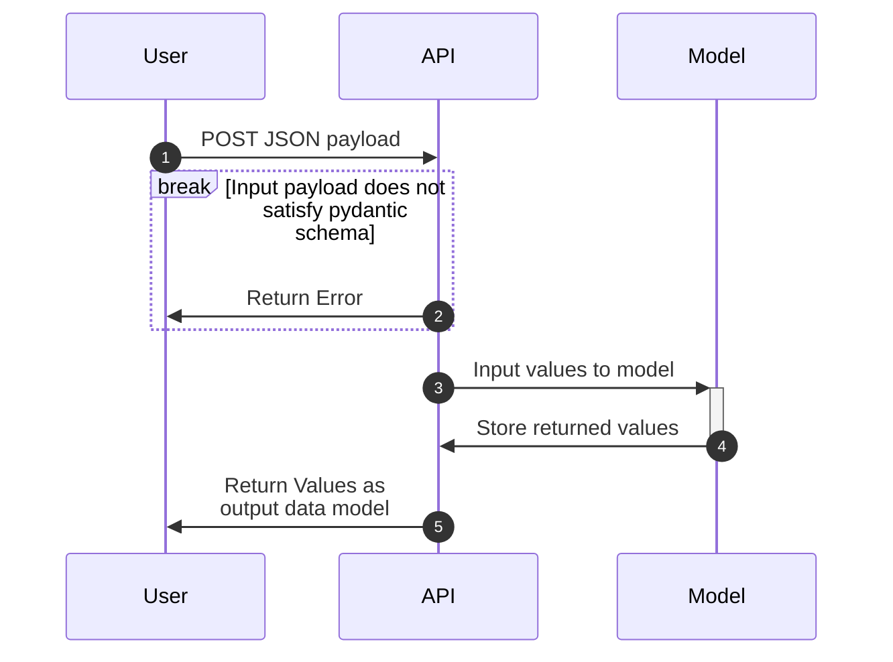
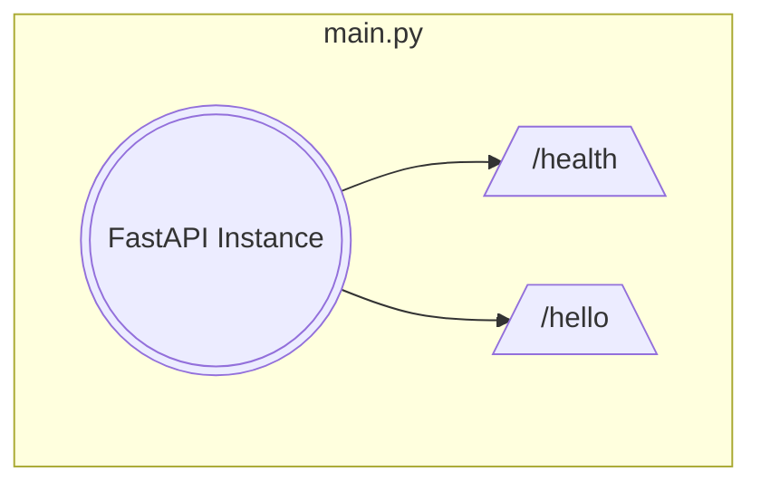
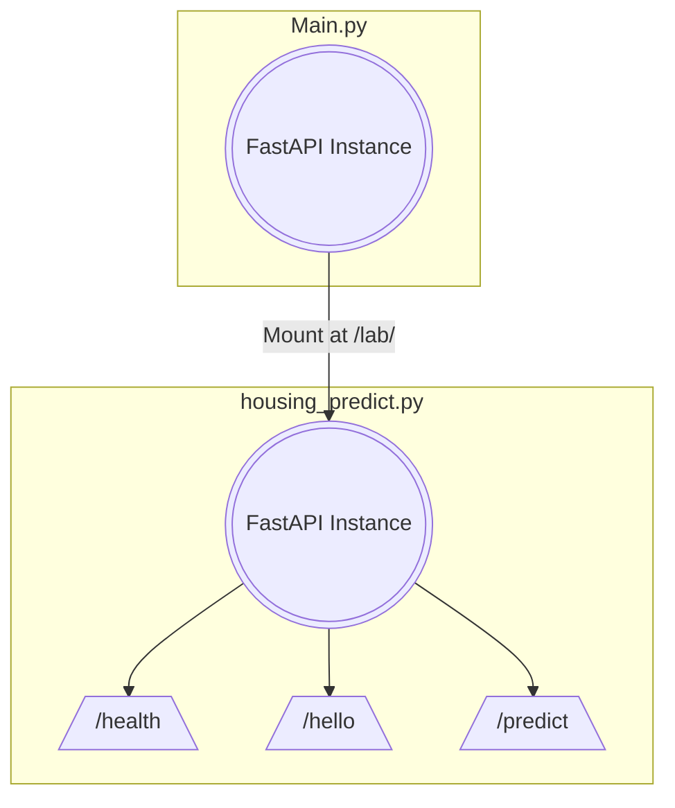

[](https://classroom.github.com/a/CBdz1OfT)
# Lab 2: Data Models and Inference

<p align="center">
  
          
  
  
  
  
</p>

- [Lab 2: Data Models and Inference](#lab-2-data-models-and-inference)
  - [Lab Overview](#lab-overview)
  - [Lab Objectives](#lab-objectives)
  - [Lab Setup](#lab-setup)
    - [Training Script](#training-script)
    - [Expected Final Folder Structure](#expected-final-folder-structure)
  - [Lab Requirements](#lab-requirements)
    - [Sequence Diagram](#sequence-diagram)
    - [FastAPI Subapplications](#fastapi-subapplications)
      - [Lab1 Application](#lab1-application)
      - [Lab2 and Onward Application](#lab2-and-onward-application)
  - [Grading](#grading)
  - [Helpful Tips](#helpful-tips)
    - [How To Approach This Lab](#how-to-approach-this-lab)
    - [Dataset Background](#dataset-background)
    - [Inference with Scikit-learn in Production Environments](#inference-with-scikit-learn-in-production-environments)
    - [Training Script (Tips)](#training-script-tips)
    - [Inference Notes](#inference-notes)
    - [Pydantic Power](#pydantic-power)
    - [FastAPI Power](#fastapi-power)
    - [Testing Requirements](#testing-requirements)
    - [Cleaning Up Docker Images](#cleaning-up-docker-images)
    - [Mermaid Diagrams](#mermaid-diagrams)
  - [Time Expectations](#time-expectations)

---

## Lab Overview

The goal of `lab2` is to extend your `FastAPI` application from `lab1`. You will add an additional endpoint called `/predict` that appropriately handles common error scenarios. You do not need to manage your submission via pull requests. We will need this as a base for `lab3`.

We recommend reading through all [Lab Objectives](#lab-objectives) and [Helpful Tips](#helpful-tips) before starting this lab.

## Lab Objectives

1. Extend your `lab1` application (i.e., keep all API functionality, containerization, etc.)
1. Add additional library dependencies to your application with `poetry`
1. Run the provided training script to generate a `sklearn` based ML model
1. Add a [pydantic model](https://pydantic-docs.helpmanual.io/usage/models/#basic-model-usage) to validate data inputs
1. Create a new `FastAPI` endpoint to serve predictions based on a pre-trained model
1. Expand your `pytest` testing framework to account for the new functionality
1. Containerize your application with `Docker`
1. Document your work with a `README.md` for how to build, run, and test code in the app root directory
1. Answer several short answer questions (2-3 sentences) to help solidify your understanding of this lab. There is a prompt for the questions in `SHORT-ANSWERS.md`

## Lab Setup

We have inited a simple project for you and included the training script. Please add appropriate dependencies and files to support the requirements.

### Training Script

Review the [Training Script (Tips)](#training-script-tips) section for more tips about this system we provided.

### Expected Final Folder Structure

```{text}
.
├── .github
│   └── autogenerated_files_do_not_worry/
├── README.md
├── SHORT-ANSWER.md
└── lab2
    ├── Dockerfile
    ├── README.md
    ├── model_pipeline.pkl
    ├── poetry.lock
    ├── pyproject.toml
    ├── src
    │   ├── __init__.py
    │   ├── housing_predict.py
    │   └── main.py
    ├── tests
    │   ├── __init__.py
    │   └── test_src.py
    └── trainer
        ├── predict.py
        └── train.py
```

## Lab Requirements

Extend your `lab1` work with the following enhancements:

- [x] Keep all endpoints from `lab1`

- [ ] Add the following additional packages to your poetry main dependencies
  - | Package      | Version |
    |--------------|---------|
    | joblib       | 1.4.2   |
    | scikit-learn | 1.5.2   |

- [ ] Train the model using the provided script
  - You will need to train that model locally on your machine (See [Training Script Tips](#training-script-tips) for more details).

- [ ] Create appropriate [pydantic models](https://pydantic-docs.helpmanual.io/usage/models/#basic-model-usage) for your new prediction endpoint.
  - [ ] Create a Pydantic model for data input (request)
    - See [Dataset Background](#dataset-background) to help define your data model
  - [ ] Create a Pydantic model for data output (response)
  - [ ] Add a [field data validator](https://docs.pydantic.dev/latest/concepts/validators/#field-validators) on the input model to verify that the `Latitude` and `Longitude` features are valid
    - Apply only fundamental limits for `Latitude` and `Longitude`; do not limit to California.
    - Raise a `ValueError` and return the message `Value error, Invalid value for Latitude` and `Value error, Invalid value for Longitude` respectively. Let the framework help you and test accordingly.

- [ ] Create a new file called `housing_predict.py` in your `src/` directory

  - Review [the documentation from FastAPI on how you can create larger applications with mounting sub-applications](https://fastapi.tiangolo.com/advanced/sub-applications/)
  - [ ] Create a new `FastAPI` instance within `housing_predict.py` to create a separate sub-application, which will be imported into your `main.py` later
  - [ ] Migrate your `/hello` endpoint to the `housing_predict.py` file
  - [ ] Migrate your `/health` endpoint to the `housing_predict.py` file
  - [ ] Modify your `/health` endpoint such that it will respond to `GET` requests with the current date/time in [ISO8601 format](https://docs.python.org/3/library/datetime.html).
    - The health endpoint should return values in the format of

      ```JSON
      {"time": "2023-09-01T17:56:46.425347"}
      ```

  - [ ] Create a new endpoint for the sub-application at `/predict` that will handle `POST` requests with inputted data by returning inference results.
  - [ ] Transform and preprocess your data into a format your `sklearn` pipeline can understand.
    - **Do not use `pandas` to preprocess your data.** `pandas` is a particularly heavy library and is unnecessary for this task; it will only make our final image size much larger due to the dependency size. You will get a points deduction for utilizing or including `pandas`. If you include `pandas` in your submission, you will automatically receive a `50` in the lab.
  - [ ] Return the inferred results from the `sklearn` model
  - [ ] Ensure that your `/predict` endpoint leverages the `pydantic` models for input and return output
    - If data is passed that does not meet the input schema for the model (bad input, extra inputs, non-matching types), your application should throw an error. Let the framework help you and test accordingly.
  - [ ] Ensure that your `/predict` endpoint handles a single input and output for the request/response cycle. Batch inputs and outputs will be part of lab 3.
  - [ ] Import your `housing_predict.py` file into your `main.py` and `mount` your sub-application such that your `/predict` endpoint is available at `/lab/predict`
    - Please name the `FastAPI` instance in your `main.py` as `app` i.e. `app = FastAPI()`
  - Review [Inference Notes](#inference-notes) for more pointers.

- [ ] Utilize `pytest` to expand your existing `lab1` test suite to test the `lab2` endpoints. Follow the same guidelines as with `lab1`
  - Create a series of tests that **include but are not limited to**:
    - Test that all endpoints respond correctly to the right inputs
    - Test that all endpoints respond correctly to the incorrect inputs
    - Test the endpoints with a variety of values.
    - Any other tests which you believe will demonstrate that your API is functioning as needed

- [ ] Create a `Dockerfile` for packaging and running the application
    1. Ensure that your `Dockerfile` will build and run your `lab2` application
    2. Extend the functionality of your `Dockerfile` by adding a `HEALTHCHECK` for the API
       - You can find [reference documentation here](https://docs.docker.com/engine/reference/builder/#healthcheck)
       - This should be polling your new `/health` endpoint
    3. Use `python:3.11-slim` for the build and application image and the following for build dependencies. This ensures that you're not building `scipy`, `numpy`, and `scikit-learn` from source (saves time for you and the automated feedback system)

        ```Dockerfile
        RUN apt-get update \
            && apt-get install -y \
                 curl \
                 build-essential \
                 libffi-dev \
            && rm -rf /var/lib/apt/lists/*
        ```

- [ ] Document your work in the `README.md` within the `lab2/` directory
  - What your application does
  - How to build your application
  - How to run your application
  - How to test your application

- [ ] Answer the questions provided in your `SHORT-ANSWERS.md` with 2-3 succinct sentences for each question

### Sequence Diagram



### FastAPI Subapplications

We will utilize the sub-application functionality in FastAPI to help organize our applications.
This will be more relevant for future labs.

The subapplication system that we will implement can better be understood with the following visual

#### Lab1 Application



#### Lab2 and Onward Application



## Grading

All code will be graded off your repo's `main` branch. No additional forms or submission processes are needed.

> [!IMPORTANT]
> We provide the autograder as a form of automated feedback. After your submission, we will add additional tests to the autograder, which ensure the veracity of your solution; the requirements will not change but will ensure that you follow the requirements presented in this readme.

|       **Criteria**       |         **0%**          |                                     **50%**                                     |                              **90%**                               |                              **100%**                              |
| :----------------------: | :---------------------: | :-----------------------------------------------------------------------------: | :----------------------------------------------------------------: | :----------------------------------------------------------------: |
|     *Functional API*     |    No Endpoints Work    |                            Some Endpoints Functional                            |                     Most Endpoints Functional                      |                          All Criteria Met                          |
|    *Docker Practices*    |      No Dockerfile      | Dockerfile exists but not functional or does not fit criteria (i.e. multistage) | Dockerfile fulfills most requirements but does not meet all listed |                          All Criteria Met                          |
|        *Testing*         |   No Testing is done    |          Minimal amount of testing done. No testing of new endpoints.           |          Only "happy path" tested and with minimal cases           |                          All Criteria Met                          |
|     *Documentation*      | No Documentation exists |                             Very weak documentation                             |                Documentation missing some elements                 |                          All Criteria Met                          |
| *Short-Answer Questions* | No Questions Attempted  |                          Minimal or incorrect answers                           | Mostly well thought through answers but may be missing some points | Clear and succinct answers that demonstrate understanding of topic |

---

## Helpful Tips

The following notes are non-exhaustive tips to consider when working through this lab.

### How To Approach This Lab

We have done our best to organize the requirements in the same way you should approach accomplishing the lab. If you complete each requirement in succession, you should not run into major problems. Focus on each individual task, and once you feel that you have accomplished it, move on to the next section (you can use the markdown checkboxes to help keep track of your progress). **Commit early and commit often**.

### Dataset Background

We will use the [California Housing Dataset](https://scikit-learn.org/stable/datasets/real_world.html#california-housing-dataset) built into `sklearn` as our model.
While you will not need to perform regression or analytics on the dataset, you will need to be familiar with the input features, their types, and their outputs.
Study the provided training script we provide to get a better sense of how inputs and outputs are expected.

Your input model's keys are expected to match the attribute names exactly.

Your validator should verify that the input `Longitude` and `Latitude` values are valid.
You can use [this reference page from Google to understand what that validator should check for](https://developers.google.com/maps/documentation/javascript/reference/coordinates)

### Inference with Scikit-learn in Production Environments

We have decided to use a combination of `poetry` and `joblib` to ensure that the training and inference of the statistical model created by scikit-learn will be consistent.
For example, if you train the model on your local machine which is running a much newer version of scikit-learn, there may be incompatibilities and other problems which could arise if your inference server (your API) does not match that version used.
[Read the following documentation to learn more about the different ways to handle running scikit-learn models in production and some of the pitfalls](https://scikit-learn.org/stable/model_persistence.html#replicating-the-training-environment-in-production)

### Training Script (Tips)

We provide the `trainer` directory containing the necessary code to train an ML model.
You do not need to modify this script.
The output of the script will create a `.pkl` file for you to load in your API

You will not need to modify our training script, but you should understand how it creates its values.

- What is it using to create the model?
- How does it create the model artifact?
- How can you load the created model artifact in your API?
- How can you give inputs to the created model?

### Inference Notes

You will need to input values from your Pydantic object to the model file; how should you transform that object into something that the model can take as input?

- Since you are sending data to `/predict` it **will not** be a `GET` and instead will be `POST`.
  - You will need to write a `curl` or `requests` command to hit it effectively and send data. It might benefit you to write your tests first prior to actually hitting your `/predict` endpoint.
- Review the `predict.py` we provide in the `trainer/` folder to see how you can run a prediction, this is the value you should return

### Pydantic Power

- Your values should be "typed" to be reasonable for the values. Check the documentation on the dataset as your reference point.
- The names that you use for the data values are important and should be semantically sensible for both the input model and the output model (i.e., Do not use `x` as a variable name)

### FastAPI Power

- This is a great opportunity to look into the documentation of FastAPI and take advantage of things like the variety of decorators that are available to you.

- If FastAPI already handles something for you, you need not rewrite the functionality yourself if you can justify what it is doing.

- FastAPI and Pydantic have native integration, which you can use to your advantage ([See Documentation](https://fastapi.tiangolo.com/tutorial/body/?h=pydantic#import-pydantics-basemodel))

### Testing Requirements

- Consider what is appropriate for you to test in your current persona (building the architecture engineer, not a data scientist)
- What if the model changes/new data is trained? Don't test the model's output for reasonability (i.e., the predicted value is in a range that seems correct). Because models get updated/retrained, weights will shift, so the output range you place in your tests will be invalid.
- Focus on the underlying mechanism of the API (when we did a prediction, did it return a result of the right type?) as opposed to the value range that it returns.

### Cleaning Up Docker Images

Docker, especially on development machines, can take up a lot of space with various images, cached layers, and containers. It is good to understand the implications of this as well as how to ensure you don't overload your storage. [Check out this documentation from Docker](https://docs.docker.com/config/pruning/)

### Mermaid Diagrams

Mermaid diagrams are incredibly helpful and have a low barrier to entry to begin diagramming and documenting systems. You can find [helpful documentation here](https://mermaid-js.github.io/mermaid/#/sequenceDiagram).
You can interactively create diagrams utilizing the [online live editor](https://mermaid-js.github.io/mermaid-live-editor/). Mermaid diagrams are natively rendered in Github; you should copy the code block described in [Sequence Diagram](#sequence-diagram) and use this as a reference.

## Time Expectations

| Previous Experience                                                                                                                | Time Estimate |
| ---------------------------------------------------------------------------------------------------------------------------------- | ------------- |
| `lab1` is well understood, experience with `GET` vs. `POST` methods, and using `pytest`                                            | 8 Hours       |
| `lab1` went okay, but I don't understand everything completely yet. It takes a while to decide the next steps, even with understanding. | 20 hours      |
| Struggled with `lab1` and have trouble writing tests with `pytest` or new endpoints in `FastAPI`                                  | 30 hours      |
